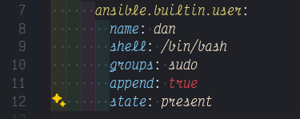

# User manual on how to use iso

This is a step by step guide, if you face any issues or have any questions, head to [readme](README.md)

Follow these steps to the tea, if you face any issues, read the readme or google!

<br>
Plug in thumbdrive with the ISO

Boot up laptop and go to boot menu and choose the ISO<br>
Let it run, when it finishes it'll show an empty ubuntu desktop without "Install Ubuntu 22.04 LTS"


Go to admin laptop that will run the ansible script<br>
Run the following commands
```bash
ansible-playbook -i /etc/ansible/playbooks/clean_apt.yml
```
Then add the/a new user<br>
Edit the file in `/etc/ansible/playbooks/add_user.yml` <br>
Change dan to something else
<br>
Then Run the follow commands
```
ansible-playbook -i /etc/ansible/playbooks/install_tunes.yml
ansible-playbook -i /etc/ansible/playbooks/install_edge.yml
ansible-playbook -i /etc/ansible/playbooks/install_teams.yml
```
That's all!
Don't forget to manually set up the printer!